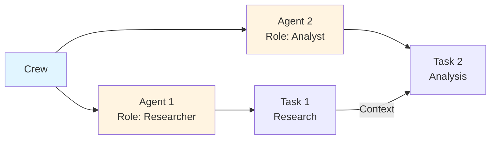
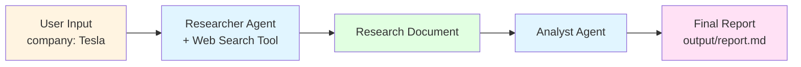

# Financial Researcher

[](https://github.com/aditya-caltechie/ai-crew-financial-researcher/actions)

A multi-agent AI application that performs comprehensive financial research and reporting on companies using the [CrewAI](https://github.com/joaomdmoura/crewai) open-source framework. Two specialized agents collaborate: a **Researcher** gathers data via web search, and an **Analyst** synthesizes it into a structured markdown report.

**CrewAI** is a Python framework for orchestrating autonomous AI agents. It lets you define agents (with roles, goals, and tools), chain them into tasks, and run them as a Crew. Agents collaborate by passing context between tasks and can use tools like web search, making CrewAI well-suited for multi-step research, analysis, and automation pipelines.

Unlike the **OpenAI SDK** (a low-level API client you orchestrate manually), CrewAI provides built-in agent, task, and crew abstractions. Compared to **LangGraph** (graph-based state machines for complex control flow) and **AutoGen** (conversation-centric multi-agent chat), CrewAI is simpler and more task-oriented: you define roles and outputs, and the framework runs the pipeline. It’s a good fit when you want structured multi-step workflows without building orchestration from scratch.

---

## Purpose

This project demonstrates how to build an AI-powered research pipeline with CrewAI. It automates the workflow of:

1. **Research** — Gathering information on a company (status, performance, challenges, news, outlook)
2. **Analysis** — Creating a professional report with executive summary, key insights, and market outlook

Use it to quickly produce research reports on any public company for due diligence, market analysis, or learning.

### What is CrewAI?

CrewAI orchestrates AI agents to work together on complex tasks:



**Key concepts:**
- **Crew** = Team of agents working together
- **Agent** = AI team member with a role, goal, and tools
- **Task** = Work item assigned to an agent
- **Context** = Output from one task passed to another

### Quick reference

| Task        | Directory                  | Command                          |
|-------------|----------------------------|----------------------------------|
| Install deps| `src/financial_researcher/` | `uv sync`                        |
| Run project | `src/financial_researcher/` | `uv sync` then `crewai run`      |
| Run tests   | `src/financial_researcher/` | `uv sync --extra dev` then `uv run pytest tests/` |

---

## Features

- **Multi-agent orchestration** — Sequential pipeline with specialized agents
- **Web search integration** — Serper API for real-time company data and news
- **Structured output** — Markdown reports saved to `output/report.md`
- **Config-driven design** — Agents and tasks defined in YAML for easy customization
- **Multiple LLM support** — Researcher uses OpenAI; Analyst uses Groq (configurable)

---

## Architecture

### Project Flow

This project uses a simple sequential flow:



**Execution steps:**
1. User provides company name (e.g., "Tesla")
2. Researcher agent searches the web for current information
3. Research document is created
4. Analyst agent receives research as context
5. Final report is generated and saved

### How this is multi-agent (and why)

The pipeline is **multi-agent** because it uses **two specialized agents** that each own one task. The mapping from tasks to agents is defined in **`config/tasks.yaml`**:

| Task (in `config/tasks.yaml`) | Agent   | What it does |
|------------------------------|--------|--------------|
| **research_task**            | researcher | Gathers data on the company (status, performance, challenges, news, outlook) using web search. Produces a structured research document. |
| **analysis_task**            | analyst   | Takes the research as **context** and writes the final report (executive summary, insights, market outlook, professional formatting). |

**How it’s multi-agent:**

- **Two agents, two tasks:** Each task has a single `agent` (e.g. `agent: researcher`, `agent: analyst`). The Researcher does not write the report; the Analyst does not run search. Roles are split by responsibility.
- **Context links the tasks:** In `tasks.yaml`, `analysis_task` has `context: [research_task]`. That passes the Researcher’s output into the Analyst’s task so the report is based on the gathered research.
- **Sequential flow:** The crew runs `research_task` first, then `analysis_task`. So the pipeline is: **Researcher (with tools) → research output → Analyst (with that context) → report.**

**Why multi-agent (instead of one agent):**

- **Separation of concerns:** Research (finding and organizing facts) is different from analysis (synthesis, narrative, recommendations). One agent does retrieval and structuring; the other does interpretation and writing.
- **Right tools per role:** Only the Researcher needs web search (SerperDevTool). The Analyst only needs the research text. Giving one agent “search + write” would blur roles and make prompts and tool use harder to control.
- **Different LLMs per role:** The Researcher can use a fast, cost-effective model (e.g. gpt-4o-mini); the Analyst can use a different model (e.g. Groq) tuned for long-form writing. Each agent’s LLM is configured in `config/agents.yaml`.
- **Clearer outputs:** Each task has a focused `expected_output` in `tasks.yaml`. The research task yields a “research document”; the analysis task yields the “polished report.” That keeps outputs well-defined and easier to debug or extend.

So the multi-agent design comes from **tasks.yaml** (task–agent assignment and context) plus **crew.py** (agents and tools). Together they form a two-step, two-agent pipeline: research → report.

---

The application uses a **Crew** of two agents:

| Agent      | Role                      | Tools          | LLM                      |
|-----------|---------------------------|----------------|--------------------------|
| Researcher | Senior Financial Researcher | SerperDevTool  | openai/gpt-4o-mini       |
| Analyst   | Market Analyst & Report writer | —              | groq/llama-3.3-70b-versatile |

Tasks execute sequentially: the Analyst receives the Researcher’s output as context before writing the report.

Two mechanisms drive the pipeline: **tools** (what agents can do) and **context** (what one task passes to the next). Both are configured in specific places:

| Mechanism | Where it's defined | What it does here |
|-----------|--------------------|--------------------|
| **Tools** | `crew.py` — `tools=[SerperDevTool()]` on the Researcher agent | Lets the Researcher query the web via Serper; the Analyst has no tools. |
| **Context** | `config/tasks.yaml` — `context: [research_task]` on `analysis_task` | Passes the research task's output into the Analyst's task so it can write the report. |

---

### Tools (in `crew.py`)

**SerperDevTool** is the web-search tool attached only to the **Researcher** agent in `crew.py`. It is how the pipeline gets up-to-date information.

| Aspect | Detail |
|--------|--------|
| **Why** | LLMs have a knowledge cut-off and cannot see recent news, earnings, or market events. SerperDevTool lets the Researcher query the live web so the report is based on **current** company and market data. |
| **How** | The Researcher agent is given `tools=[SerperDevTool()]`. When working on the research task, the agent calls this tool (backed by the [Serper](https://serper.dev/) search API) to run queries and receive snippets and links. That search output is then used as context for the Analyst to write the report. |
| **Config** | Requires `SERPER_API_KEY` in `.env`. The Analyst has no tools—it only uses the Researcher's output. |

### Context (in `config/tasks.yaml`)

**Context** is how one task’s output is passed as input to a later task. It is **not** set in `crew.py`—only in **`config/tasks.yaml`**. The block that passes context is under `analysis_task` (lines 31–33). This is the only place context is defined:

```yaml
# config/tasks.yaml — context being passed to the Analyst's task
analysis_task:
  agent: analyst
  context:
    - research_task   # ← research_task output is passed here as input
  output_file: output/report.md
```

When the crew runs, CrewAI runs `research_task` first (Researcher + SerperDevTool). That task's output is then injected as **context** into `analysis_task`, so the Analyst's LLM sees the research document when writing the report. The Researcher's task has no `context`; only the Analyst's task receives context.

For detailed architecture, flow diagrams, and concepts, see [docs/](docs/).

---

## Prerequisites

- **Python** 3.10–3.12
- **CrewAI** (install via project)
- **API keys** (see [Configuration](#configuration))

---

## Installation

### 1. Clone the repository

```bash
git clone <your-repo-url>
cd ai-crew-financial-researcher
```

### 2. Install dependencies with uv sync

The CrewAI project lives in `src/financial_researcher/`. **All commands below must be run from that directory.**

```bash
cd src/financial_researcher
uv sync
```

**What `uv sync` does:** Creates a virtual environment (if needed), installs dependencies from `pyproject.toml`, and generates/updates the lock file. Run it whenever you clone the repo or change dependencies.

---

## Configuration

Create a `.env` file in `src/financial_researcher/` with your API keys:

```env
# Required for the Researcher agent (OpenAI)
OPENAI_API_KEY=sk-...

# Required for the Analyst agent (Groq)
GROQ_API_KEY=gsk_...

# Required for web search (Serper)
SERPER_API_KEY=...
```

| Variable         | Used by   | Purpose                          |
|------------------|-----------|----------------------------------|
| `OPENAI_API_KEY` | Researcher | LLM for research                 |
| `GROQ_API_KEY`   | Analyst   | LLM for report writing           |
| `SERPER_API_KEY` | Researcher | Web search via SerperDevTool     |

Get keys from: [OpenAI](https://platform.openai.com/api-keys) | [Groq](https://console.groq.com/) | [Serper](https://serper.dev/)

---

## Usage

### How to run the project

**Working directory:** Always run from `src/financial_researcher/`.

```bash
cd src/financial_researcher
uv sync                    # if not already done
crewai run
```

### Customize the target company

Edit `src/financial_researcher/src/financial_researcher/main.py`:

```python
inputs = {
    'company': 'Apple'  # Change to any company name
}
```

---

## Running tests

**Working directory:** Same as the project — run from `src/financial_researcher/`.

### Step 1: Install dev dependencies

Tests require `pytest` and `pytest-mock`. Install them with:

```bash
cd src/financial_researcher
uv sync --extra dev
```

**What `uv sync --extra dev` does:** Installs the base dependencies plus the `[dev]` optional group (pytest, pytest-mock). Run this once before running tests.

### Step 2: Run the tests

```bash
cd src/financial_researcher
uv run pytest tests/
```

---

## Output

- **Console** — The full report is printed to stdout
- **File** — Saved to `src/financial_researcher/output/report.md`

---

## Project Structure

```
ai-crew-financial-researcher/
├── README.md
├── docs/
│   ├── architecture.md    # Architecture, flow diagrams
│   ├── concepts.md        # CrewAI concepts (Crew, Agent, Task)
│   └── execution.md       # Execution logs
└── src/financial_researcher/
    ├── src/financial_researcher/
    │   ├── crew.py        # Crew, agents, tasks definition
    │   ├── main.py        # Entry point
    │   ├── config/
    │   │   ├── agents.yaml
    │   │   └── tasks.yaml
    │   └── tools/
    │       └── custom_tool.py
    ├── output/
    │   └── report.md      # Generated report
    ├── knowledge/         # Optional knowledge sources
    └── pyproject.toml
```

---

## Documentation

| Document        | Description                                      |
|-----------------|--------------------------------------------------|
| [AGENTS.md](AGENTS.md) | Contributor map: layout, components, run commands |
| [docs/architecture.md](docs/architecture.md) | Architecture, flow diagram, components           |
| [docs/concepts.md](docs/concepts.md)         | CrewAI basics: Crew, Flow, Agent, Task           |
| [docs/execution.md](docs/execution.md)       | Example execution and results                    |

---

## Related CrewAI Projects

Two other CrewAI projects from the same author explore different orchestration patterns and use cases:

### [ai-crew-stock-picker](https://github.com/aditya-caltechie/ai-crew-stock-picker)

StockPicker is a **hierarchical** multi-agent system: a Manager agent delegates to worker agents that find trending companies in a sector, research each in depth, and recommend the best one for investment. It uses **Serper** for web search, **Pushover** for optional push notifications, **Pydantic** for structured outputs, and **RAG + SQLite** for long-term, short-term, and entity memory. Inputs are sector and date; outputs include trending companies, research reports, and a final stock pick (with optional push). Good for learning hierarchical orchestration and memory-backed pipelines.

### [ai-crew-engineering-team](https://github.com/aditya-caltechie/ai-crew-engineering-team)

Engineering Team is a **sequential** four-agent pipeline that turns natural language requirements into a full software deliverable: an **Engineering Lead** produces a design doc, a **Backend Engineer** implements a Python module, a **Frontend Engineer** builds a Gradio demo UI, and a **Test Engineer** writes unit tests. Code is executed inside **Docker** via CrewAI’s Code Interpreter for safety. Inputs are requirements text, module name, and class name; outputs are design markdown, backend module, `app.py`, and tests under a single `output/` directory. No external APIs—code generation and execution only.

---

## Comparison: All Three CrewAI Projects

| Aspect | ai-crew-financial-researcher _(this project)_ | [ai-crew-stock-picker](https://github.com/aditya-caltechie/ai-crew-stock-picker) | [ai-crew-engineering-team](https://github.com/aditya-caltechie/ai-crew-engineering-team) |
|--------|----------------------------------------------|-----------------------------------------------------------------------------------|------------------------------------------------------------------------------------------|
| **Process** | Sequential (2 tasks) | Hierarchical (Manager → workers) | Sequential (4 tasks) |
| **Agents** | 2 (Researcher, Analyst) | Manager + worker agents (finder, researcher, picker) | 4 (Engineering Lead, Backend, Frontend, Test Engineer) |
| **Input** | Company name | Sector, date | Requirements (natural language), module name, class name |
| **Output** | Markdown report | Best stock pick, JSON reports, push notification | Design doc, Python backend, Gradio UI, unit tests |
| **Tools** | SerperDevTool (web search) | Serper, Pushover, RAG + SQLite | Code Interpreter (Docker) |
| **External APIs** | Serper | Serper, Pushover | None (code-only) |
| **Memory** | No | Yes (long-term, short-term, entity) | No |
| **Structured output** | Markdown | Pydantic models + markdown | Markdown + Python files |
| **Code execution** | No | No | Yes (Docker sandbox) |
| **Use case** | Research & reporting on one company | Investment recommendation (find → research → pick) | Automated software development (design → code → UI → tests) |

**Pipeline summary**

- **Financial Researcher** _(this project)_ — Search → research document → report. Best for learning sequential flows and Serper integration.
- **Stock Picker** — Manager delegates: find trending companies → research each → pick best → optional push. Demonstrates hierarchical orchestration, memory, and notifications.
- **Engineering Team** — Design → code → UI → tests. Full software lifecycle automation with code generation and execution in Docker.

---

## Create a New CrewAI Project

To scaffold a new CrewAI project from scratch:

```bash
crewai create crew my_project_name
```

---
