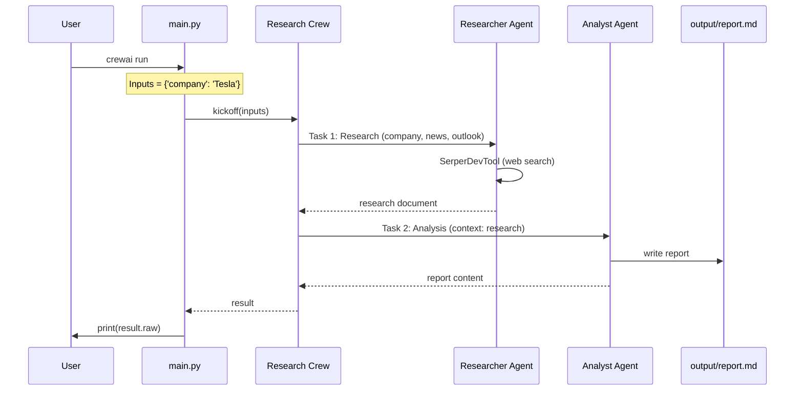

# AI Crew Financial Researcher — Architecture

> **See also:** [CrewAI Concepts — Basics](concepts.md) for Crew vs Flow, agents, tasks, and code flow.

## Overview

The **AI Crew Financial Researcher** is a CrewAI-based application that orchestrates multiple AI agents to perform comprehensive financial research and reporting on companies. The system uses a sequential pipeline: a **Researcher** agent gathers data, then an **Analyst** agent synthesizes it into a structured report.

---

## Flow Diagram - **Mermaid version** :



---

## How CrewAI Works

CrewAI is an open-source framework for orchestrating autonomous AI agents. Its core concepts are:

### Core Components

| Component | Description |
|-----------|-------------|
| **Agent** | An AI entity with a role, goal, and backstory. Agents use LLMs and optional tools to perform work. |
| **Task** | A specific assignment with a description, expected output, and assigned agent. Tasks define what work gets done. |
| **Crew** | A team of agents that collaborate to complete a set of tasks according to a defined process. |
| **Process** | The orchestration strategy for task execution (e.g., sequential, hierarchical). |

### Execution Flow

```
┌─────────────────────────────────────────────────────────────────────────────┐
│                              Crew Kickoff                                    │
│  ResearchCrew().crew().kickoff(inputs={'company': 'Tesla'})                  │
└─────────────────────────────────────────────────────────────────────────────┘
                                        │
                                        ▼
┌─────────────────────────────────────────────────────────────────────────────┐
│                         Process: Sequential                                  │
│  Tasks execute one after another; each task's output is context for the next │
└─────────────────────────────────────────────────────────────────────────────┘
                                        │
                    ┌───────────────────┴───────────────────┐
                    ▼                                       ▼
┌───────────────────────────────┐           ┌───────────────────────────────────┐
│  Task 1: research_task        │           │  Task 2: analysis_task             │
│  Agent: Senior Financial      │  ──────►  │  Agent: Market Analyst             │
│  Researcher                   │  context  │  (uses research output as input)   │
│  Tools: SerperDevTool         │           │  Output: output/report.md          │
└───────────────────────────────┘           └───────────────────────────────────┘
```

### Process Types

- **Sequential**: Tasks run in predefined order. Each task receives the output of prior tasks as context.
- **Hierarchical**: A manager agent delegates tasks to agents based on roles and expertise, then reviews outputs.

This project uses **Sequential** process.

### Task Context & Dependencies

Tasks can depend on others via the `context` attribute. The `analysis_task` uses `context: [research_task]`, so it receives the researcher’s output as input before generating the final report.

---

## Project Architecture

### High-Level Structure

```
ai-crew-financial-researcher/
├── src/financial_researcher/
│   ├── src/financial_researcher/
│   │   ├── crew.py              # Crew definition (agents, tasks, process)
│   │   ├── main.py              # Entry point & kickoff
│   │   ├── config/
│   │   │   ├── agents.yaml      # Agent roles, goals, backstories, LLMs
│   │   │   └── tasks.yaml       # Task descriptions, expected outputs, dependencies
│   │   └── tools/
│   │       └── custom_tool.py   # Template for custom tools
│   ├── knowledge/               # Optional knowledge sources
│   │   └── user_preference.txt
│   ├── output/
│   │   └── report.md            # Final report output
│   └── pyproject.toml           # CrewAI project config
└── docs/
    ├── architecture.md          # This document
    └── execution.md             # Execution logs and results
```

### Component Diagram

```
┌─────────────────────────────────────────────────────────────────────────────┐
│                           ResearchCrew (@CrewBase)                            │
├─────────────────────────────────────────────────────────────────────────────┤
│  Agents (from config/agents.yaml)                                            │
│  ┌─────────────────────────────┐  ┌─────────────────────────────────────┐   │
│  │  researcher                 │  │  analyst                             │   │
│  │  Role: Senior Financial     │  │  Role: Market Analyst & Report       │   │
│  │        Researcher           │  │        writer                        │   │
│  │  LLM: openai/gpt-4o-mini    │  │  LLM: groq/llama-3.3-70b-versatile   │   │
│  │  Tools: SerperDevTool       │  │  Tools: none                         │   │
│  └─────────────────────────────┘  └─────────────────────────────────────┘   │
├─────────────────────────────────────────────────────────────────────────────┤
│  Tasks (from config/tasks.yaml)                                              │
│  ┌─────────────────────────────┐  ┌─────────────────────────────────────┐   │
│  │  research_task              │  │  analysis_task                       │   │
│  │  • Company research         │  │  • Create report from research       │   │
│  │  • 5 focus areas            │  │  • Executive summary, sections       │   │
│  │  • agent: researcher        │  │  • agent: analyst                    │   │
│  │                             │  │  • context: [research_task]          │   │
│  │                             │  │  • output_file: output/report.md     │   │
│  └─────────────────────────────┘  └─────────────────────────────────────┘   │
├─────────────────────────────────────────────────────────────────────────────┤
│  Crew                                                                        │
│  • process: Process.sequential                                               │
│  • verbose: True                                                             │
└─────────────────────────────────────────────────────────────────────────────┘
```

---

## Component Details

### Agents

Defined in `config/agents.yaml` with placeholders (e.g. `{company}`) filled from `kickoff(inputs={...})`.

| Agent | Role | Goal | LLM |
|-------|------|------|-----|
| **researcher** | Senior Financial Researcher | Research company, news, and potential | openai/gpt-4o-mini |
| **analyst** | Market Analyst & Report writer | Analyze company and create structured report | groq/llama-3.3-70b-versatile |

The researcher uses **SerperDevTool** for web search. The analyst uses no tools and focuses on analysis and writing.

### Tasks

| Task | Agent | Description | Output |
|------|-------|-------------|--------|
| **research_task** | researcher | Gather structured research on the company (status, performance, challenges, news, outlook) | Research document |
| **analysis_task** | analyst | Turn research into an executive summary, analysis, and market outlook | `output/report.md` |

`analysis_task` depends on `research_task` via `context: [research_task]`.

### Tools

- **SerperDevTool** (from `crewai_tools`): Internet search used by the researcher.
- **MyCustomTool** (in `tools/custom_tool.py`): Template for custom tools; not used in the current pipeline.

---

## Execution Flow

1. **Entry point**: `main.py` runs `ResearchCrew().crew().kickoff(inputs={'company': 'Tesla'})`.
2. **Crew setup**: CrewAI loads agents and tasks from YAML, wiring tools and context.
3. **Task 1 – Research**:
   - Researcher uses SerperDevTool for web search.
   - Produces a structured research document.
4. **Task 2 – Analysis**:
   - Analyst receives the research document as context.
   - Produces a final report and writes it to `output/report.md`.
5. **Return**: The last task’s output is returned as the crew result.

### Running the Project

```bash
# From project root (where crewai is configured)
crewai run
```

Or via Python:

```python
from financial_researcher.main import run
run()
```

---

## Configuration

### CrewAI Project (`pyproject.toml`)

```toml
[tool.crewai]
type = "crew"
```

Entry points:

- `financial_researcher` / `run_crew` → `financial_researcher.main:run`
- `train`, `replay`, `test` → `financial_researcher.main`

### Environment Variables

Required for tools and LLMs:

- `OPENAI_API_KEY` – for the researcher agent
- `GROQ_API_KEY` – for the analyst agent
- `SERPER_API_KEY` – for SerperDevTool web search

---

## Extending the Architecture

- **New agents**: Add entries in `config/agents.yaml` and `@agent` methods in `crew.py`.
- **New tasks**: Add entries in `config/tasks.yaml` and `@task` methods in `crew.py`.
- **Custom tools**: Implement tools in `tools/` and attach them to agents in `crew.py`.
- **Hierarchical process**: Set `process=Process.hierarchical` and configure `manager_llm` or `manager_agent` in the Crew.
