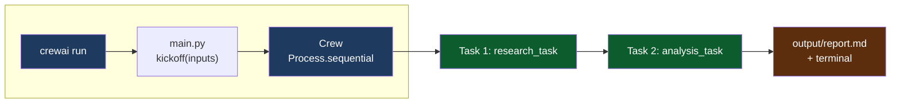
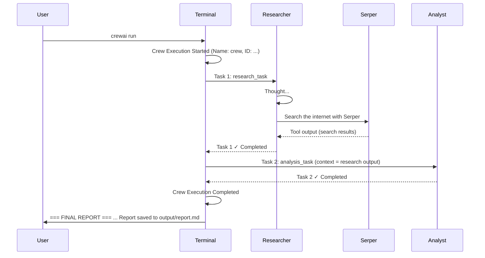
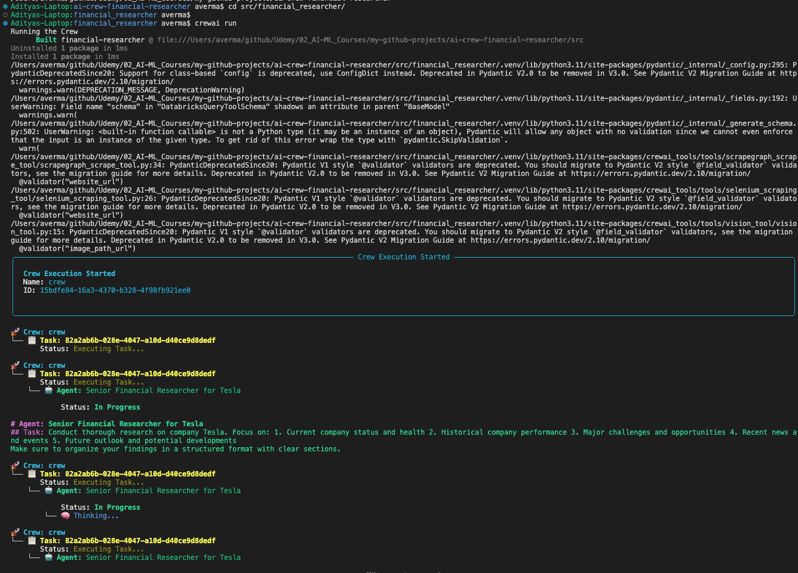
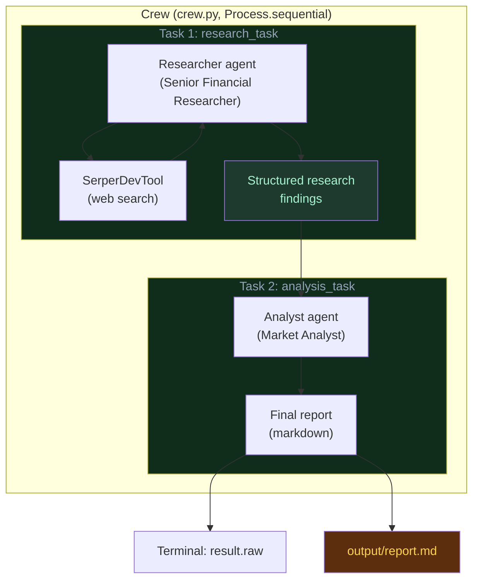
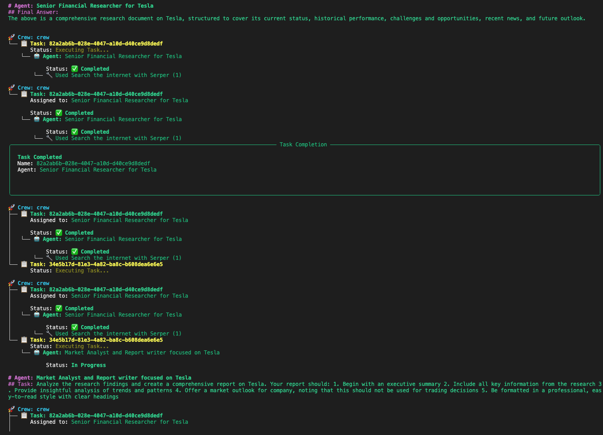
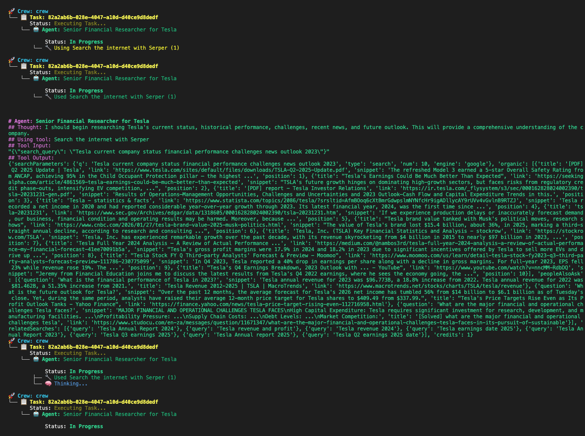
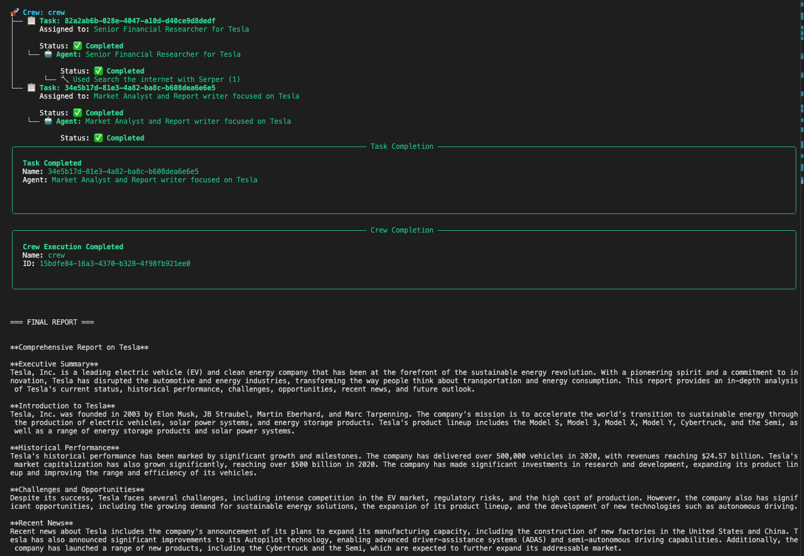

# Demo: Running the Financial Researcher Crew

This document walks through **what happens when you run the crew**, how the terminal output maps to the code, and how the **sequential agent workflow** produces the final company report.

---

## Flow at a glance

What you see in the terminal when you run the crew matches this path:



From **run** → **crew** → **Task 1** (research) → **Task 2** (analysis) → **report** on disk and in the terminal.

**What appears in the terminal** (as in the demo screenshots) follows this sequence:



**Screenshots from a real run** (what you see when you run the code):

| Step | Screenshot | What it shows |
|------|------------|---------------|
| 1 | [Start and first task](#1-startup-and-crew-initialization) | `crewai run`, build, Crew Execution Started, research task assigned, "Thinking..." |
| 2 | [Researcher uses Serper](#3-task-1-research-researcher-agent) | Thought, tool input (search query), Serper tool output (search results) |
| 3 | [Task handoff](#2-sequential-flow-two-tasks-two-agents) | Research task ✓ Completed, analysis task Executing, Market Analyst task description |
| 4 | [Completion and report](#5-final-report-in-the-terminal-and-on-disk) | Both tasks ✓ Completed, Crew Execution Completed, FINAL REPORT and content |

---

## How to Run

From the CrewAI project root (`src/financial_researcher/`):

```bash
cd src/financial_researcher/
crewai run
```

Alternatively:

```bash
cd src/financial_researcher
python -m financial_researcher.main
```

The entry point is `main.py`: it sets `inputs = {'company': 'Tesla'}`, builds the crew with `ResearchCrew().crew()`, and calls `kickoff(inputs=inputs)`. The `crewai run` command invokes this same flow.

---

## What You See: Execution Flow

When you run the crew, the terminal shows a **sequential execution** of two tasks by two agents. Below is what each phase means and how it ties to `crew.py` and the config.

### 1. Startup and crew initialization

After `crewai run` you may see:



*Figure 1: Running `crewai run`, project build, Crew Execution Started (Name: crew, ID), and Task 1 assigned to the Senior Financial Researcher with status "In Progress" and "Thinking...".*

- **Building the project** — CrewAI builds the `financial-researcher` package and may install/uninstall packages.
- **Pydantic warnings** — Deprecation warnings from dependencies (e.g. `crewai_tools`); they do not stop the run.
- **Crew Execution Started** — A box showing:
  - **Name:** `crew`
  - **ID:** a unique run ID (e.g. `15bdfe84-16a3-4370-b328-4f98fb921ee0`)

This corresponds to the crew created in `crew.py`:

```python
return Crew(
    agents=self.agents,
    tasks=self.tasks,
    process=Process.sequential,
    verbose=True,
)
```

The **sequential process** means tasks run in a fixed order; the next section shows that order.

---

### 2. Sequential flow: two tasks, two agents

The run executes **two tasks in order**, each assigned to a different agent.



| Order | Task (config)   | Agent (config) | What happens |
|-------|-----------------|----------------|---------------|
| 1     | `research_task` | `researcher`   | Web research on the company using Serper |
| 2     | `analysis_task` | `analyst`      | Writes the report using research output as context |



*Figure 3: Research task marked Completed (with "Used Search the internet with Serper"), Task Completion divider, then analysis task (Market Analyst) Executing / In Progress with its full task description.*

This order and assignment come from:

- **`crew.py`** — `Process.sequential` and the order of `@task` methods (and how tasks are collected).
- **`config/tasks.yaml`** — `research_task` is assigned to `researcher`; `analysis_task` is assigned to `analyst` and has `context: [research_task]`, so it runs after the research task and receives its output.

So when you see the log:

1. **Task 1** (e.g. ID `82a2ab6b-028e-4047-a10d-d40ce9d8dedf`) — **Senior Financial Researcher for Tesla** executes the research task.
2. **Task 2** (e.g. ID `34e5b17d-81e3-4a82-ba8c-b608dea6e6e5`) — **Market Analyst and Report writer focused on Tesla** executes the analysis task.

The researcher must finish before the analyst starts; the analyst’s input is the researcher’s output.

---

### 3. Task 1: Research (Researcher agent)

The log shows something like:

- **Crew:** crew  
- **Task:** \<UUID for research_task\>  
- **Status:** Executing Task… → In Progress  
- **Agent:** Senior Financial Researcher for Tesla  

The **task description** shown in the log matches `config/tasks.yaml` for `research_task`:

- Conduct thorough research on **{company}** (e.g. Tesla).
- Focus on: current status, historical performance, challenges and opportunities, recent news, future outlook.
- Organize findings in a structured format.

The researcher agent is defined in `crew.py` with **SerperDevTool**:

```python
return Agent(
    config=self.agents_config['researcher'],
    verbose=True,
    tools=[SerperDevTool()],
)
```

So the researcher **uses the Serper tool** to search the web. In the log you’ll see:

- **Thought** — Short reasoning, e.g. that it will research Tesla’s status, performance, challenges, news, and outlook.
- **Using tool: Search the internet with Serper**
- **Tool input** — e.g. `{"search_query": "Tesla current company status financial performance challenges news outlook 2023"}`
- **Tool output** — Raw search results (organic results, “people also ask”, related searches) that the agent uses to build its research output.



*Figure 2: Senior Financial Researcher's Thought, "Using tool: Search the internet with Serper", the search query sent to Serper, and the raw tool output (organic results, peopleAlsoAsk, relatedSearches).*

When the research task is done, the log shows **Task Completion** for that task and agent. That completed output is the **context** for the next task.

---

### 4. Task 2: Analysis and report (Analyst agent)

After the research task completes:

- **Task:** \<UUID for analysis_task\>  
- **Status:** Executing Task… → In Progress  
- **Agent:** Market Analyst and Report writer focused on Tesla  

The **task description** matches `analysis_task` in `config/tasks.yaml`:

- Analyze the research findings and create a comprehensive report on **{company}**.
- Include: executive summary, key information, analysis of trends, market outlook (with a disclaimer that it is not for trading decisions), professional formatting with clear headings.

The analyst agent in `crew.py` has **no tools**; it only uses its LLM and the context passed from the research task:

```python
return Agent(
    config=self.agents_config['analyst'],
    verbose=True
)
```

The **context** is set in `tasks.yaml`:

```yaml
analysis_task:
  ...
  context:
    - research_task  # Receives researcher's output as input
  output_file: output/report.md
```

So the analyst’s input is the researcher’s structured findings. When this task completes, the log shows **Task Completion** for the analysis task and the agent, then **Crew Execution Completed** for the crew.

---

### 5. Final report in the terminal and on disk

After the crew finishes, `main.py` prints the final output and a confirmation:



*Figure 4: Task 1 and Task 2 both Completed (green checkmarks), Crew Execution Completed with crew Name and ID, then "=== FINAL REPORT ===" and the markdown report (Executive Summary, Introduction, Historical Performance, etc.) — same content saved to `output/report.md`.*

```
=== FINAL REPORT ===

... markdown content of the report ...

Report has been saved to output/report.md
```

The **FINAL REPORT** section is the **raw output of the last task** (`result.raw` in `main.py`), i.e. the analyst’s report. It is also written to disk because `analysis_task` has `output_file: output/report.md` in `tasks.yaml` (and is set in `crew.py` as well).

**Where the report is saved**

- **Relative to the CrewAI project root** (`src/financial_researcher/`):  
  `output/report.md`
- **From the repository root**:  
  `src/financial_researcher/output/report.md`

The report typically includes:

- **Executive summary** — Overview of the company and the report.
- **Introduction** — Company background, mission, products.
- **Historical performance** — Key figures, growth, market cap.
- **Challenges and opportunities** — Risks and positives.
- **Recent news** — Notable events and developments.
- **Market outlook** — Forward-looking view (with a non–trading-advice disclaimer).

All of this is produced by the **analyst** agent from the **researcher** agent’s structured findings, in one sequential pass.

---

## How the code drives this behavior

| What you see in the demo | Where it’s defined |
|--------------------------|--------------------|
| Two tasks run one after the other | `crew.py`: `Process.sequential` and task order |
| Researcher runs first, uses web search | `crew.py`: `researcher` agent with `SerperDevTool()`; `tasks.yaml`: `research_task` → `researcher` |
| Analyst runs second, writes the report | `crew.py`: `analyst` agent (no tools); `tasks.yaml`: `analysis_task` → `analyst`, `context: [research_task]` |
| Report content and structure | `config/tasks.yaml`: `analysis_task` description and expected_output |
| Report saved to `output/report.md` | `config/tasks.yaml`: `output_file: output/report.md`; `crew.py`: `output_file='output/report.md'` on analysis_task |
| Company name (e.g. Tesla) in prompts and report | `main.py`: `inputs = {'company': 'Tesla'}`; placeholders `{company}` in `agents.yaml` and `tasks.yaml` |

---

## Summary

- **Run:** `crewai run` from `src/financial_researcher/`.
- **Flow:** Sequential: **research_task** (researcher + Serper) → **analysis_task** (analyst, using research as context).
- **Output:** The final company report is printed to the terminal and saved to **`output/report.md`** (relative to the project root).

For more on agents and tasks, see `docs/concepts.md` and `docs/architecture.md`. For raw execution logs, see `docs/execution.md`.
