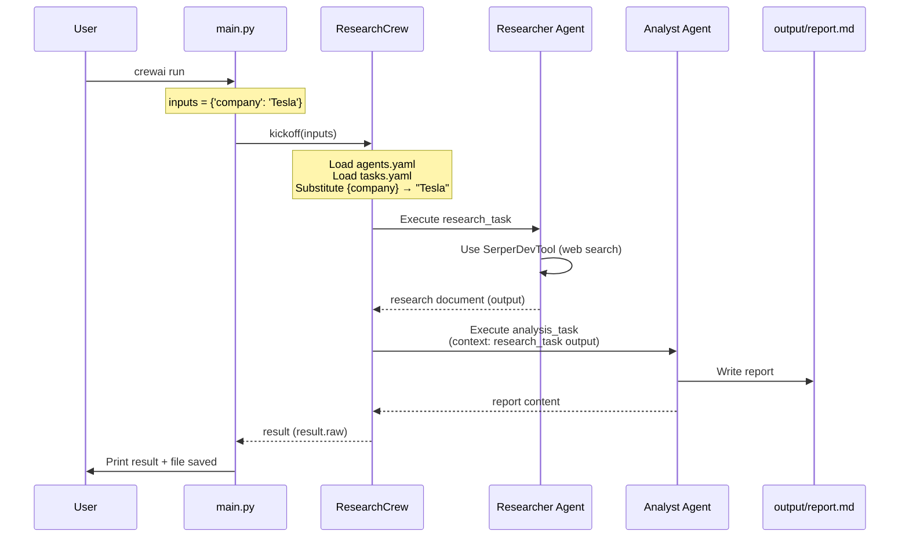
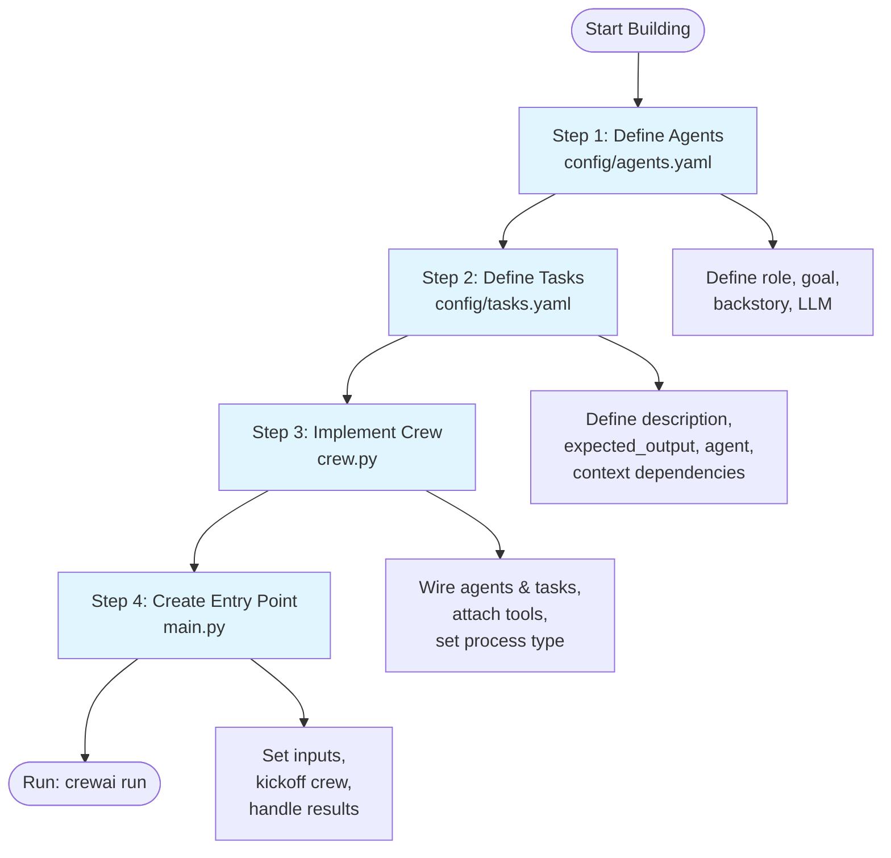
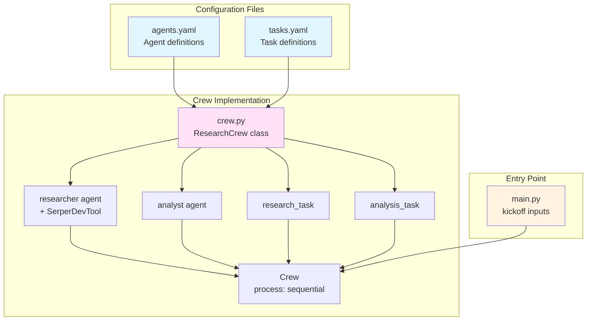

# CrewAI Implementation Guide

> **Step-by-step guide for building CrewAI projects**  
> This document provides a clear, sequential approach to implementing multi-agent systems using CrewAI.

---

## Table of Contents

1. [Implementation Order](#implementation-order)
2. [Step-by-Step Guide](#step-by-step-guide)
3. [CrewAI Core Concepts](#crewai-core-concepts)
4. [Flow Diagrams](#flow-diagrams)
5. [Best Practices](#best-practices)

---

## Implementation Order

Follow this exact sequence when building a CrewAI project:

```
1. Define Agents (config/agents.yaml)
   ↓
2. Define Tasks (config/tasks.yaml)
   ↓
3. Implement Crew Logic (crew.py)
   ↓
4. Create Entry Point (main.py)
```

**Why this order?**
- **Agents first**: You need to know who will do the work before defining what work needs to be done
- **Tasks second**: Tasks reference agents, so agents must exist first
- **Crew third**: The crew wires agents and tasks together, so both must be defined
- **Main last**: Entry point orchestrates everything, so the crew must be ready

---

## Step-by-Step Guide

### Step 1: Define Agents (`config/agents.yaml`)

**Purpose**: Define the AI team members who will perform work.

**What to include**:
- `role`: What the agent does (e.g., "Senior Financial Researcher")
- `goal`: What the agent aims to achieve
- `backstory`: Background that shapes behavior and decision-making
- `llm`: The language model to use (e.g., `openai/gpt-4o-mini`)

**Example**:
```yaml
researcher:
  role: >
    Senior Financial Researcher for {company}
  goal: >
    Research the company, news and potential for {company}
  backstory: >
    You're a seasoned financial researcher with a talent for finding
    the most relevant information about {company}.
  llm: openai/gpt-4o-mini
```

**Key Points**:
- Use placeholders like `{company}` that will be filled from `inputs` in `main.py`
- Choose LLMs based on task complexity (faster/cheaper for research, more capable for analysis)
- Write clear, specific roles and goals to guide agent behavior

**Tools**: Don't add tools here. Tools are attached in `crew.py` (Step 3).

---

### Step 2: Define Tasks (`config/tasks.yaml`)

**Purpose**: Define the work items that agents will execute.

**What to include**:
- `description`: What needs to be done (be specific and detailed)
- `expected_output`: What "done" looks like
- `agent`: Which agent performs this task (must match an agent name from Step 1)
- `context` (optional): List of task names whose outputs should be used as input
- `output_file` (optional): Where to save the result

**Example**:
```yaml
research_task:
  description: >
    Conduct thorough research on company {company}. Focus on:
    1. Current company status and health
    2. Historical company performance
    3. Major challenges and opportunities
    4. Recent news and events
    5. Future outlook and potential developments
  expected_output: >
    A comprehensive research document with well-organized sections covering
    all the requested aspects of {company}.
  agent: researcher

analysis_task:
  description: >
    Analyze the research findings and create a comprehensive report on {company}.
    Your report should:
    1. Begin with an executive summary
    2. Include all key information from the research
    3. Provide insightful analysis of trends and patterns
  expected_output: >
    A polished, professional report on {company} that presents the research
    findings with added analysis and insights.
  agent: analyst
  context:
    - research_task  # This task receives research_task's output as input
  output_file: output/report.md
```

**Key Points**:
- **Task dependencies**: Use `context` to pass outputs from one task to another
- **Sequential execution**: Tasks with `context` will run after their dependencies
- **Clear descriptions**: Be specific about what you want—agents follow instructions closely
- **Agent assignment**: Each task must reference an agent defined in Step 1

---

### Step 3: Implement Crew Logic (`crew.py`)

**Purpose**: Wire agents and tasks together, attach tools, and define execution process.

**Structure**:
```python
from crewai import Agent, Crew, Process, Task
from crewai.project import CrewBase, agent, crew, task
from crewai_tools import SerperDevTool  # or your custom tools

@CrewBase
class ResearchCrew():
    """Your crew class - name it descriptively"""

    # Step 3a: Define agents (loads from config/agents.yaml)
    @agent
    def researcher(self) -> Agent:
        return Agent(
            config=self.agents_config['researcher'],
            verbose=True,
            tools=[SerperDevTool()],  # Attach tools here
        )

    @agent
    def analyst(self) -> Agent:
        return Agent(
            config=self.agents_config['analyst'],
            verbose=True
        )

    # Step 3b: Define tasks (loads from config/tasks.yaml)
    @task
    def research_task(self) -> Task:
        return Task(
            config=self.tasks_config['research_task']
        )

    @task
    def analysis_task(self) -> Task:
        return Task(
            config=self.tasks_config['analysis_task'],
            output_file='output/report.md'  # Can override YAML here
        )

    # Step 3c: Create the crew
    @crew
    def crew(self) -> Crew:
        return Crew(
            agents=self.agents,      # Auto-collected from @agent methods
            tasks=self.tasks,        # Auto-collected from @task methods
            process=Process.sequential,  # or Process.hierarchical
            verbose=True,
        )
```

**Key Points**:
- **`@CrewBase`**: Required decorator that enables YAML config loading
- **`@agent`**: Methods that return `Agent` instances (loads from `agents.yaml`)
- **`@task`**: Methods that return `Task` instances (loads from `tasks.yaml`)
- **`@crew`**: Method that returns the `Crew` instance
- **Tools**: Attach tools to agents here (e.g., `tools=[SerperDevTool()]`)
- **Process**: Choose `Process.sequential` (tasks run in order) or `Process.hierarchical` (manager delegates)

**Tool Attachment**:
- Import tools: `from crewai_tools import SerperDevTool`
- Attach in `@agent` method: `tools=[SerperDevTool()]`
- For custom tools: Import from `tools/custom_tool.py` and attach similarly

---

### Step 4: Create Entry Point (`main.py`)

**Purpose**: Initialize the crew and trigger execution.

**Structure**:
```python
import os
from financial_researcher.crew import ResearchCrew

# Create output directory if needed
os.makedirs('output', exist_ok=True)

def run():
    """
    Run the research crew.
    """
    # Step 4a: Define inputs (fills placeholders in YAML configs)
    inputs = {
        'company': 'Tesla'  # This replaces {company} in agents.yaml and tasks.yaml
    }

    # Step 4b: Create and run the crew
    result = ResearchCrew().crew().kickoff(inputs=inputs)

    # Step 4c: Handle results
    print("\n\n=== FINAL REPORT ===\n\n")
    print(result.raw)
    print("\n\nReport has been saved to output/report.md")

if __name__ == "__main__":
    run()
```

**Key Points**:
- **Inputs**: Dictionary that fills placeholders (e.g., `{company}` → `inputs['company']`)
- **Kickoff**: `kickoff(inputs=inputs)` starts execution
- **Results**: `result.raw` contains the final output (last task's output)
- **Output files**: Tasks with `output_file` write automatically

---

## CrewAI Core Concepts

### Agent

An **Agent** is an AI team member with:
- **Role**: What they do (e.g., "Senior Financial Researcher")
- **Goal**: What they aim to achieve
- **Backstory**: Background that shapes behavior
- **LLM**: Language model (e.g., GPT-4, Llama)
- **Tools** (optional): Capabilities like web search, file operations, API calls

**Example**: A researcher agent uses SerperDevTool to search the web, then analyzes results using its LLM.

### Task

A **Task** is a concrete piece of work with:
- **Description**: What needs to be done
- **Expected output**: What "done" looks like
- **Agent**: Who performs it
- **Context** (optional): Outputs from other tasks used as input
- **Output file** (optional): Where to save the result

**Example**: A research task gathers data, then an analysis task uses that data as context to create a report.

### Crew

A **Crew** is a team of agents that collaborate on tasks:
- **Agents**: The team members
- **Tasks**: The work items
- **Process**: How tasks execute (sequential or hierarchical)

**Example**: A research crew with a researcher agent and analyst agent executing tasks in sequence.

### Process Types

#### Sequential (`Process.sequential`)

Tasks run in predefined order. Each task receives outputs from prior tasks as context.

```
Task 1 → Task 2 → Task 3
  │         │         │
output1  output2   output3
  │         │
  └─────────┘
  context for Task 2
```

**Use when**: You have a clear pipeline (e.g., research → analysis → report).

#### Hierarchical (`Process.hierarchical`)

A manager agent delegates tasks to agents based on roles, then reviews outputs.

```
Manager Agent
  ├─→ Delegate Task 1 → Agent A
  ├─→ Delegate Task 2 → Agent B
  └─→ Review outputs → Final result
```

**Use when**: You need dynamic task assignment or review workflows.

**This project uses Sequential process.**

### Context & Dependencies

Tasks can depend on others via `context`:

```yaml
analysis_task:
  context:
    - research_task  # Receives research_task's output as input
```

In sequential process, tasks with `context` automatically run after their dependencies.

---

## Flow Diagrams

### High-Level Execution Flow



### Implementation Sequence



### Data Flow in Sequential Process

```mermaid
flowchart LR
    Input[inputs = {'company': 'Tesla'}] --> Agent1[Researcher Agent]
    Agent1 --> Task1[research_task<br/>Uses SerperDevTool]
    Task1 --> Output1[Research Document]
    Output1 --> Agent2[Analyst Agent]
    Agent2 --> Task2[analysis_task<br/>Context: research_task]
    Task2 --> Output2[Final Report<br/>output/report.md]
    
    style Input fill:#fff4e1
    style Output1 fill:#e1f5ff
    style Output2 fill:#e1ffe1
```

### Component Relationships



---

## Best Practices

### 1. Start Simple

- Begin with 2 agents and 2 tasks
- Use sequential process first
- Add complexity gradually

### 2. Clear Agent Roles

- Make roles specific and distinct
- Avoid overlapping responsibilities
- Use descriptive names (e.g., `researcher`, `analyst`, not `agent1`, `agent2`)

### 3. Detailed Task Descriptions

- Be specific about what you want
- Use numbered lists for clarity
- Include examples when helpful

### 4. Use Context Wisely

- Only add `context` when a task truly needs prior outputs
- Keep dependency chains short (avoid deep nesting)
- Document why tasks depend on each other

### 5. Tool Selection

- Use built-in tools (`crewai_tools`) when possible
- Create custom tools only when needed
- Attach tools to agents that need them (not all agents)

### 6. LLM Selection

- Use faster/cheaper models for simple tasks (research, data gathering)
- Use more capable models for complex tasks (analysis, writing)
- Consider token limits for long outputs

### 7. Testing

- Test with simple inputs first
- Verify outputs match expected format
- Check that context flows correctly between tasks

### 8. Error Handling

- Handle missing API keys gracefully
- Validate inputs before kickoff
- Check output files are created correctly

---

## Quick Reference Checklist

When building a new CrewAI project:

- [ ] **Step 1**: Define agents in `config/agents.yaml`
  - [ ] Role, goal, backstory, LLM for each agent
  - [ ] Use placeholders for dynamic values (`{company}`)
  
- [ ] **Step 2**: Define tasks in `config/tasks.yaml`
  - [ ] Description, expected_output, agent assignment
  - [ ] Add `context` for task dependencies
  - [ ] Set `output_file` if needed
  
- [ ] **Step 3**: Implement crew in `crew.py`
  - [ ] Create class with `@CrewBase`
  - [ ] Add `@agent` methods (load from YAML)
  - [ ] Add `@task` methods (load from YAML)
  - [ ] Attach tools to agents
  - [ ] Create `@crew` method with process type
  
- [ ] **Step 4**: Create entry point in `main.py`
  - [ ] Define inputs dictionary
  - [ ] Call `kickoff(inputs=inputs)`
  - [ ] Handle results and output files

---

## Common Pitfalls

1. **Wrong order**: Defining tasks before agents (tasks reference agents)
2. **Missing context**: Forgetting to add `context` when tasks depend on each other
3. **Tool attachment**: Adding tools in YAML instead of `crew.py`
4. **Placeholder mismatch**: Using `{company}` in YAML but `{ticker}` in inputs
5. **Process confusion**: Using hierarchical when sequential is simpler

---

## Next Steps

- Read [Architecture Documentation](architecture.md) for detailed component descriptions
- Read [CrewAI Concepts](concepts.md) for deeper understanding
- Check [Execution Logs](execution.md) for example runs
- Explore [CrewAI Documentation](https://docs.crewai.com) for advanced features

---

**Remember**: Start simple, test often, and iterate. CrewAI is powerful but requires clear definitions of agents, tasks, and their relationships.
